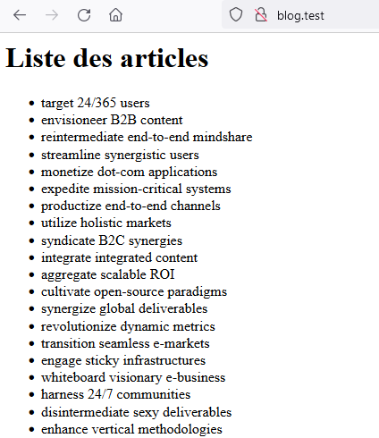
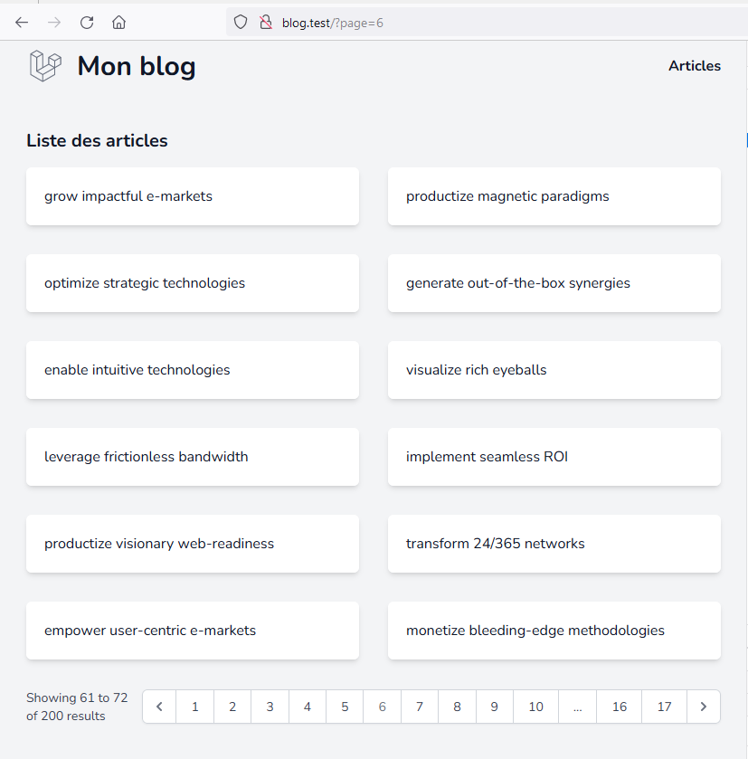

# Blog

[[toc]]

## Installation

Pour installer Laravel, nous allons utiliser la commande `composer create-project` à partir de la ligne de commande. Cette commande va créer une nouvelle application Laravel pour nous et installer toutes les dépendances nécessaires.

Voici la commande à utiliser pour créer notre nouveau blog Laravel :

```bash
composer create-project laravel/laravel blog
```

Cette commande va télécharger la dernière version de Laravel et l'installer dans un dossier nommé **blog**. Une fois l'installation terminée, nous pouvons entrer dans le répertoire **blog** avec la commande suivante :

```bash
cd blog
```

Maintenant que notre application Laravel est installée, nous pouvons commencer à la configurer pour notre blog.

## Base de données

### Configuration

La prochaine étape dans la construction de notre application de blog consiste à configurer notre base de données. Tout d'abord, nous devons créer une base de données pour notre blog à l'aide d'un outil tel que phpMyAdmin ou MySQL Workbench. Une fois que nous avons créé notre base de données, nous devons modifer le fichier .env situé à la racine de notre projet.

Dans ce fichier, nous devons définir les informations de connexion à notre base de données. Les informations requises comprennent le nom de l'hôte, le nom d'utilisateur, le mot de passe et le nom de la base de données. Voici un exemple de configuration de base de données pour une installation locale :

```dotenv
DB_CONNECTION=mysql
DB_HOST=127.0.0.1
DB_PORT=3306
DB_DATABASE=nom_de_votre_base_de_donnees
DB_USERNAME=nom_d_utilisateur
DB_PASSWORD=mot_de_passe
```

## Modélisation de la base de données

La première étape pour modéliser la base de données de notre application de blog est de déterminer les modèles dont nous avons besoin et les relations entre ces modèles. Dans notre cas, nous aurons besoin d'un modèle Article et d'un modèle User.

Le modèle Article aura les champs suivants:

- title: titre de l'article
- body: corps de l'article
- img_path: chemin de l'image associée à l'article
- published_at: date de publication de l'article

Nous utiliserons le modèle User fourni par Laravel pour gérer les utilisateurs de notre application.

Les modèles Article et User seront en relation en utilisant l'association "appartient à". Cela signifie que chaque article appartiendra à un seul utilisateur. Nous pouvons représenter cette relation en utilisant un diagramme de classe:

[](https://mermaid.ink/img/eyJjb2RlIjoiY2xhc3NEaWFncmFtXG4gICAgY2xhc3MgQXJ0aWNsZSB7XG4gICAgICAgIC1pZDogaW50XG4gICAgICAgIC10aXRsZTogc3RyaW5nXG4gICAgICAgIC1ib2R5OiBzdHJpbmdcbiAgICAgICAgLWltZ19wYXRoOiBzdHJpbmdcbiAgICAgICAgLXB1Ymxpc2hlZF9hdDogZGF0ZVxuICAgICAgICBcbiAgICB9XG4gICAgY2xhc3MgVXNlciB7XG4gICAgICAgIC1pZDogaW50XG4gICAgICAgIC1uYW1lOiBzdHJpbmdcbiAgICAgICAgLWVtYWlsOiBzdHJpbmdcbiAgICB9XG4gICAgQXJ0aWNsZSAtLSogVXNlclxuICAgICIsIm1lcm1haWQiOnsidGhlbWUiOiJkZWZhdWx0In0sInVwZGF0ZUVkaXRvciI6ZmFsc2V9)

Notez que c'est une relation de composition, car un article ne peut pas exister sans un utilisateur. Cela signifie que si nous supprimons un utilisateur, tous les articles associés à cet utilisateur seront également supprimés.

### Modèle et Migration

Dans Laravel, les modèles sont utilisés pour représenter les données dans la base de données. Il est très simple de créer un modèle pour notre relation de composition entre l'utilisateur et l'article en utilisant la commande `php artisan make:model Article -mf`. Cela créera un fichier `Article.php` dans le répertoire `app/Models`. Il créera également un fichier de migration dans le répertoire `database/migrations/` et un fichier de factory dans le répertoire `database/factories/`.

Dans ce fichier, vous pouvez définir la relation de composition entre l'utilisateur et l'article en ajoutant le code suivant dans la classe `Article` :

```php
class Article extends Model
{
    public function user()
    {
        return $this->belongsTo(User::class);
    }
}
```

Nous devons aussi définir la relation inverse dans le modèle `User`:

```php
class User extends Authenticatable
{
    public function articles()
    {
        return $this->hasMany(Article::class);
    }
}
```

Laravel utilise les migrations pour gérer la structure de la base de données. Pour créer une migration pour notre modèle `Article`, nous pouvons aussi utiliser la commande `php artisan make:migration create_articles_table`. Cela créera un fichier de migration dans le répertoire `database/migrations/` qui peut être utilisé pour définir les champs pour la table `articles`.

Vous devez ajouter les champs à la méthode `up` de la migration:

```php
use Illuminate\Database\Migrations\Migration;
use Illuminate\Database\Schema\Blueprint;
use Illuminate\Support\Facades\Schema;

return new class() extends Migration {
    /**
     * Run the migrations.
     */
    public function up()
    {
        Schema::create('articles', function (Blueprint $table) {
            $table->id();
            $table->string('title');
            $table->text('body');
            $table->string('img_path')->nullable();
            $table->timestampTz('published_at')->nullable();
            $table->foreignId('user_id')->constrained()->onDelete('cascade');
            $table->timestamps();
        });
    }

    /**
     * Reverse the migrations.
     */
    public function down()
    {
        Schema::dropIfExists('articles');
    }
};

```

Enfin, pour exécuter la migration, utilisez la commande `php artisan migrate`. Cela créera la table `articles` dans votre base de données en fonction de la définition du fichier de migration.

### Création d'une fabrique pour les articles

Pour générer des articles fictifs dans notre base de données, nous allons utiliser les fabriques de Laravel.

#### Étape 1 : Création de la fabrique

Nous pouvons créer une fabrique en utilisant la commande suivante dans le terminal :

```php
php artisan make:factory ArticleFactory --model=Article
```

Cette commande créera un fichier de fabrique dans le répertoire database/factories nommé **ArticleFactory.php**.

#### Étape 2 : Configuration de la fabrique

Dans ce fichier, nous allons définir les champs que nous voulons que notre fabrique génère pour chaque article fictif. Voici un exemple :

```php
namespace Database\Factories;

use App\Models\User;
use Illuminate\Database\Eloquent\Factories\Factory;

/**
 * @extends \Illuminate\Database\Eloquent\Factories\Factory<\App\Models\Article>
 */
class ArticleFactory extends Factory
{
    /**
     * Define the model's default state.
     *
     * @return array<string, mixed>
     */
    public function definition()
    {
        return [
            'title' => fake()->bs(),
            'body' => fake()->realTextBetween($minNbChars = 500, $maxNbChars = 2000),
            'img_path' => function () {
                $absolutePath = fake()->image(storage_path('app/public/images'), 640, 480, 'cats', true);

                return str_replace(storage_path('app/public/'), '', $absolutePath);
            },
            'published_at' => fake()->dateTimeBetween('-2 months', '+ 1 month'),
            'user_id' => User::get()->random()->id,
        ];
    }
}
```

### Remplissage de la base de données avec le DatabaseSeeder

Avec Laravel, nous pouvons utiliser la classe DatabaseSeeder pour remplir notre base de données avec des données fictives. Pour ce faire, nous allons utiliser les **factories** que nous avons créées plus tôt. Voici comment cela peut être fait :

Dans le terminal, nous exécutons la commande `php artisan make:seeder ArticlesTableSeeder`. Cela créera un nouveau **fichier de semeur** dans le répertoire `database/seeds`.

Dans ce nouveau fichier, nous allons ajouter le code suivant :

```php
use App\Article;
use Illuminate\Database\Seeder;

class ArticlesTableSeeder extends Seeder
{
    /**
     * Run the database seeds.
     *
     * @return void
     */
    public function run()
    {
        factory(Article::class, 50)->create();
    }
}
```

Nous allons maintenant enregistrer notre nouveau semeur dans le fichier DatabaseSeeder. Pour ce faire, nous ajoutons la ligne suivante dans la méthode `run` :

```php
$this->call(ArticlesTableSeeder::class);
```

N'oubliez pas décommenter les lignes suivantes dans le fichier `DatabaseSeeder.php` :

```php
namespace Database\Seeders;

// use Illuminate\Database\Console\Seeds\WithoutModelEvents;
use Illuminate\Database\Seeder;

class DatabaseSeeder extends Seeder
{
    /**
     * Seed the application's database.
     */
    public function run()
    {
        \App\Models\User::factory(10)->create();

        \App\Models\User::factory()->create([
            'name' => 'Test User',
            'email' => 'test@example.com',
        ]);

        $this->call(ArticlesTableSeeder::class);
    }
}
```

Enfin, nous pouvons exécuter la commande `php artisan db:seed` pour **remplir** notre base de données avec des **articles fictifs**.

Et voilà ! Maintenant, notre base de données est **complète** avec des articles fictifs et nous pouvons commencer à construire notre application de blog.

Pour recréer la base de données et la remplir avec des données fictives, nous pouvons utiliser la commande `php artisan migrate:fresh --seed`.

## Authentification avec Laravel Breeze

Pour installer Laravel Breeze, nous pouvons utiliser la commande suivante :

```bash
composer require laravel/breeze --dev
```

Une fois l'installation terminée, nous pouvons générer les fichiers nécessaires à l'authentification en utilisant la commande :

```bash
php artisan breeze:install

  Which stack would you like to install?
  blade ............................. 0
  react ............................. 1
  vue ............................... 2
  api ............................... 3
❯ 0
0

  Would you like to install dark mode support? (yes/no) [no]
❯ yes

  Would you prefer Pest tests instead of PHPUnit? (yes/no) [no]
❯ yes
```

Cette commande va créer les vues, les contrôleurs et les routes nécessaires à l'authentification. Nous pouvons maintenant commencer à utiliser Laravel Breeze pour gérer les utilisateurs de notre application.

## Création de la page d'accueil

### Configuration de la Homepage

Nous allons maintenant créer notre contrôleur `HomepageController` qui aura la responsabilité de gérer la page d'accueil de notre blog. Pour ce faire, nous allons utiliser la commande de génération de contrôleur de Laravel :

```bash
php artisan make:controller HomepageController
```

Cela va créer un nouveau fichier `app/Http/Controllers/HomepageController.php`. Ouvrons-le et écrivons la méthode `index` qui sera en charge de récupérer les articles à afficher sur la page d'accueil :

```php
namespace App\Http\Controllers;

use App\Models\Article;

class HomepageController extends Controller
{
    public function index()
    {
        $articles = Article::all();

        return view('homepage.index', [
            'articles' => $articles,
        ]);
    }
}
```

Maintenant, nous allons modifier la route de base de Laravel pour qu'elle appelle notre méthode `index` :

```php
Route::get('/', [HomepageController::class, 'index']);
```

Enfin, nous allons créer la vue associée, `resources/views/homepage/index.blade.php`, qui affichera la liste des articles :

```php
<h1>Liste des articles</h1>
<ul>
  @foreach($articles as $article)
  <li>{{ $article->title }}</li>
  @endforeach
</ul>
```

Résultat :



Avec ces modifications, notre application est maintenant capable d'afficher la liste des articles sur la page d'accueil.

### Création du layout

La première étape consiste à modifier le fichier `guest.blade.php` dans le dossier `resources/views/layouts/`. Ce fichier servira de layout pour notre frontend et contiendra les éléments communs à toutes les pages, tels que le header et le footer.

```php
<!DOCTYPE html>
<html lang="{{ str_replace('_', '-', app()->getLocale()) }}">

<head>
    <meta charset="utf-8">
    <meta name="viewport" content="width=device-width, initial-scale=1">
    <meta name="csrf-token" content="{{ csrf_token() }}">

    <title>{{ config('app.name', 'Laravel') }}</title>

    <!-- Fonts -->
    <link rel="stylesheet" href="https://fonts.bunny.net/css2?family=Nunito:wght@400;600;700&display=swap">

    <!-- Scripts -->
    @vite(['resources/css/app.css', 'resources/js/app.js'])
</head>

<body class="font-sans text-gray-900 antialiased">
    <div class="min-h-screen flex flex-col pt-6 sm:pt-0 bg-gray-100 dark:bg-gray-900">
        <div class="container mx-auto flex flex-col space-y-10">
            <nav class="flex justify-between items-center py-2">
                <div>
                    <a href="/"
                        class="group font-bold text-3xl flex items-center space-x-4 hover:text-emerald-600 transition ">
                        <x-application-logo
                            class="w-10 h-10 fill-current text-gray-500 group-hover:text-emerald-500 transition" />
                        <span>Mon blog</span>
                    </a>
                </div>
                <div class="flex items-center space-x-4 justify-end">
                    <a class="font-bold hover:text-emerald-600 transition" href="/">Articles</a>
                </div>
            </nav>

            <main>
                {{ $slot }}
            </main>
        </div>
    </div>
</body>

</html>
```

Une fois ce layout créé, nous pourrons étendre ce layout dans nos autres vues. Nous utiliserons le tag `<x-guest-layout>` pour indiquer que notre vue doit étendre le layout `guest.blade.php`.

```php
<x-guest-layout>
    <h1 class="font-bold text-xl mb-4">Liste des articles</h1>
    <ul class="grid sm:grid-cols-2 lg:grid-cols-3 2xl:grid-cols-4 gap-8">
        @foreach ($articles as $article)
            <li>
                <a class="flex bg-white rounded-md  shadow-md p-5 w-full hover:shadow-lg hover:scale-105 transition"
                    href="#">
                    {{ $article->title }}
                </a>
            </li>
        @endforeach
    </ul>
</x-guest-layout>
```

### Pagination

Nous allons maintenant ajouter la pagination à notre page d'accueil. Pour ce faire, nous allons utiliser la méthode `paginate` de Laravel. Cette méthode va nous permettre de récupérer les articles par page et de générer les liens de pagination. Dans le controller, nous allons modifier la méthode `index` pour récupérer les articles par page :

```php
$articles = Article::paginate(12);
```

Nous allons ensuite modifier notre vue pour afficher les liens de pagination :

```php
<x-guest-layout>
    <h1 class="font-bold text-xl mb-4">Liste des articles</h1>
    <ul class="grid sm:grid-cols-2 lg:grid-cols-3 2xl:grid-cols-4 gap-8">
        @foreach ($articles as $article)
            <li>
                <a class="flex bg-white rounded-md  shadow-md p-5 w-full hover:shadow-lg hover:scale-105 transition"
                    href="#">
                    {{ $article->title }}
                </a>
            </li>
        @endforeach
    </ul>

    <div class="mt-8">
        {{ $articles->links() }}
    </div>
</x-guest-layout>
```

Résultat:



## Les articles

### Contrôleur et routes pour les articles

Pour afficher la liste des articles, nous allons créer un `ArticleController` qui aura une méthode `index` pour afficher la liste des articles et une méthode `show` pour afficher le détail d'un article.

```bash
php artisan make:controller ArticleController
```

Nous allons ensuite ajouter les méthodes dans le controller :

```php
namespace App\Http\Controllers;

use App\Models\Article;
use Illuminate\Http\Request;

class ArticleController extends Controller
{
    public function index()
    {
        $articles = Article::paginate(12);

        return view('articles.index', [
            'articles' => $articles,
        ]);
    }

    public function show($id)
    {
        $article = Article::findOrFail($id);

        return view('articles.show', [
            'article' => $article,
        ]);
    }
}
```

Ensuite, nous allons ajouter les routes pour ces méthodes dans le fichier `routes/web.php` :

```php
Route::get('/articles', [ArticleController::class, 'index'])->name('articles.index');
Route::get('/articles/{id}', [ArticleController::class, 'show'])->name('articles.show');
```

Maintenant, nous pouvons visiter `/articles` pour voir la liste des articles et `/articles/{id}` pour voir le détail d'un article.

Nous devons modifier notre layout pour modifier le lien vers la liste des articles :

```php
<a class="font-bold hover:text-emerald-600 transition"
                        href="{{ route('articles.index') }}">Articles</a>
```

Et nous devons modifier notre vue `homepage.index` pour modifier le lien vers le détail des articles :

```php
<a class="flex bg-white rounded-md shadow-md p-5 w-full hover:shadow-lg hover:scale-105 transition"
    href="{{ route('articles.show', $article) }}">
    {{ $article->title }}
</a>
```

### Composant ArticleCard

Pour éviter de répéter le code dans plusieurs vues, nous pouvons créer un composant pour afficher un article. Nous allons donc créer un composant `ArticleCard` en utilisant la commande `make:component` :

```bash
php artisan make:component ArticleCard --view
```

Le composant sera créé dans le répertoire `resources/views/components`. Nous pouvons maintenant éditer ce fichier pour définir la vue de notre composant.

```php
<a class="flex flex-col h-full space-y-4 bg-white rounded-md shadow-md p-5 w-full hover:shadow-lg hover:scale-105 transition"
    href="{{ route('articles.show', $article) }}">
    <div class="uppercase font-bold text-gray-800">
        {{ $article->title }}
    </div>
    <div class="flex-grow text-gray-700 text-sm text-justify">
        {{ Str::limit($article->body, 120) }}
    </div>
    <div class="text-xs text-gray-500">
        {{ $article->published_at }}
    </div>
</a>
```

Ensuite, nous utilisons ce composant dans notre vue qui affiche la liste des articles :

```php
@foreach ($articles as $article)
    <li>
        <x-article-card :article="$article" />
    </li>
@endforeach
```

Nous pouvons voir que nous passons les informations de l'article avec un paramètre nommé `article`. Nous pouvons alors les utiliser dans notre composant grâce à la variable `$article`.

### Liste des articles

Nous allons maintenant créer une page qui affiche la liste des articles. Pour ce faire, nous allons créer une nouvelle vue `articles.index` :

```php
<x-guest-layout>
    <h1 class="font-bold text-xl mb-4">Liste des articles</h1>
    <ul class="grid sm:grid-cols-2 lg:grid-cols-3 2xl:grid-cols-4 gap-8">
        @foreach ($articles as $article)
            <li>
                <x-article-card :article="$article" />
            </li>
        @endforeach
    </ul>

    <div class="mt-8">
        {{ $articles->links() }}
    </div>
</x-guest-layout>
```

### Détail d'un article

Nous allons maintenant créer une page qui affiche le détail d'un article. Pour ce faire, nous allons créer une nouvelle vue `articles.show` :

```php
<x-guest-layout>
    <h1 class="font-bold text-xl mb-4">{{ $article->title }}</h1>
    <div class="mb-4 text-xs text-gray-500">
        {{ $article->published_at }}
    </div>
    <div>
        {!! \nl2br($article->body) !!}
    </div>
</x-guest-layout>
```

### Exercices

- Ajouter un lien de retour vers la liste des articles dans la page de détail d'un article.
- Afficher les images des articles dans la liste des articles et dans la page de détail d'un article.
- Ajouter un footer avec des liens vers les réseaux sociaux.
- Ajouter une page "À propos" qui affiche un texte de présentation de l'auteur. Ajouter un lien vers cette page dans le nav.
- Customiser le thème de l'application avec TailwindCSS. [documentation](https://tailwindcss.com/docs/)

Attention, pour afficher les images, il faut exécuter la commande `php artisan storage:link` pour créer un lien symbolique vers le dossier `storage/app/public` dans le dossier `public/storage`.

Ensuite, pour générer le lien vers une image, il faut utiliser la fonction `asset` :

```php
img_path) }}" alt="illustration de l'article">
```

## Administration

Nous allons créer une interface d'administration pour gérer les articles. Nous allons créer:

- une page qui affiche la liste des articles
- une page pour créer un article
- une page pour modifier un article
- un bouton pour supprimer un article

### Contrôleur et routes pour l'administration

Nous allons créer un dossier Admin dans le dossier des controlleurs. Nous y ajouterons un contrôleur `ArticleController` qui aura les méthodes `index`, `create`, `store`, `edit`, `update` et `destroy`.
Pour ce faire, nous allons utiliser un contrôleur ressource. Ce sont des contrôleurs qui ont des méthodes prédéfinies pour les actions de base d'un CRUD. Nous allons donc utiliser la commande `make:controller` avec l'option `--resource` et l'option `--model` pour spécifier le modèle associé au contrôleur :

```bash
php artisan make:controller Admin/ArticleController --resource --model=Article
```

Nous allons ensuite ajouter une route de type `resource` pour ce contrôleur dans le fichier `routes/web.php`. Nous allons également ajouter un middleware `auth` pour protéger l'accès à ces routes ainsi qu'un préfixe `admin` pour les routes de l'administration.

```php
// autres imports ...
use App\Http\Controllers\Admin\ArticleController as AdminArticleController;

// autres routes ...
Route::middleware(['auth'])->prefix('admin')->group(function () {
    Route::resource('articles', AdminArticleController::class);
});
```

Nous avons déjà un contrôleur "ArticleController" dans le dossier "app/Http/Controllers". Avec les namespaces PHP, nous pouvons utiliser le même nom de contrôleur pour deux contrôleurs différents. Pour les distringuer dans un même fichier, nous pouvons utiliser un alias. Nous avons donc utilisé l'alias `AdminArticleController` pour le contrôleur de l'administration.

### Vue pour la liste des articles

Nous allons maintenant créer une vue pour afficher la liste des articles. Nous allons créer un fichier `resources/views/admin/articles/index.blade.php` :

```php
<x-app-layout>

    <x-slot name="header">
        <h2 class="font-semibold text-xl text-gray-800 leading-tight">
            {{ __('Articles') }}
        </h2>
    </x-slot>

    <div class="py-12">
        <div class="max-w-7xl mx-auto sm:px-6 lg:px-8">
            <div class="bg-white overflow-hidden shadow-xl sm:rounded-lg">
                <div class="p-6 sm:px-20 bg-white border-b border-gray-200">
                    <div class="flex justify-between mt-8">
                        <div class=" text-2xl">
                            Liste des articles
                        </div>

                        <div class="flex  items-center justify-center space-x-8">
                            <a href="{{ route('articles.create') }}"
                                class="text-gray-500 font-bold py-2 px-4 rounded hover:bg-gray-200 transition">Ajouter un
                                article</a>
                        </div>
                    </div>

                    <div class="mt-6 text-gray-500">
                        <table class="table-auto w-full">
                            <thead>
                                <tr class="uppercase text-left">
                                    <th class="px-4 py-2 border">Titre</th>
                                    <th class="px-4 py-2 border">Auteur</th>
                                    <th class="px-4 py-2 border">Date de publication</th>
                                    <th class="px-4 py-2 border">Dernière modification</th>
                                    <th class="px-4 py-2 border">Actions</th>
                                </tr>
                            </thead>
                            <tbody>
                                @foreach ($articles as $article)
                                    <tr class="hover:bg-gray-50 odd:bg-gray-100 hover:odd:bg-gray-200 transition">
                                        <td class="border px-4 py-2">
                                            {{ $article->title }}</td>
                                        <td class="border px-4 py-2">
                                            {{ $article->user->name }}</td>
                                        <td class="border px-4 py-2">
                                            {{ $article->published_at?->diffForHumans() }}</td>
                                        <td class="border px-4 py-2">
                                            {{ $article->updated_at->diffForHumans() }}</td>
                                        <td class="border px-4 py-2 space-x-4">
                                            <a href="{{ route('articles.edit', $article->id) }}"
                                                class="text-blue-400">Edit</a>
                                            <form action="{{ route('articles.destroy', $article->id) }}" method="POST"
                                                class="inline">
                                                @csrf
                                                @method('DELETE')
                                                <button type="submit" class="text-red-400">Delete</button>
                                            </form>
                                        </td>
                                    </tr>
                                @endforeach
                            </tbody>
                        </table>

                        <div class="mt-4">
                            {{ $articles->links() }}
                        </div>
                    </div>
                </div>
            </div>
        </div>
    </div>

</x-app-layout>
```

Cette vue utilise le layout `app.blade.php`. La page contient un tableau qui affiche la liste des articles. Nous avons aussi ajouté un lien pour créer un nouvel article. Pour chaque article, nous affichons le titre, l'auteur, la date de publication et la date de dernière modification. Nous avons aussi ajouté un lien pour modifier l'article et un bouton pour supprimer l'article.

### Contrôleur pour la liste des articles

Nous allons maintenant créer la méthode `index` dans le contrôleur `Admin/ArticleController`. Cette méthode va récupérer la liste des articles et la passer à la vue `admin/articles/index.blade.php`.

```php
    public function index()
    {
        $articles = Article::orderByDesc('updated_at')
            ->paginate(10)
        ;

        return view(
            'admin.articles.index',
            [
                'articles' => $articles,
            ]
        );
    }
```

Nous utilisons la méthode `paginate` pour récupérer les articles par page. Nous avons choisi de récupérer 10 articles par page. Nous utilisons la méthode `orderByDesc` pour trier les articles par date de modification décroissante.

## Lien vers la liste des articles dans le menu

Nous allons maintenant ajouter un lien vers la liste des articles dans le menu de l'administration. Nous allons modifier le fichier `resources/views/layouts/navigation.blade.php` :

```php
<!-- Navigation Links -->
<div class="hidden space-x-8 sm:-my-px sm:ml-10 sm:flex">
    <x-nav-link :href="route('dashboard')" :active="request()->routeIs('dashboard')">
        {{ __('Dashboard') }}
    </x-nav-link>

    <!--  Lien à ajouter -->
    <x-nav-link :href="route('articles.index')" :active="request()->routeIs('articles.*')">
        {{ __('Articles') }}
    </x-nav-link>
</div>
```

Nous avons ajouté un lien vers la liste des articles. La méthode `routeIs` permet de vérifier si la route actuelle correspond à un pattern. Dans notre cas, nous voulons vérifier si la route actuelle correspond à la route `articles.index` ou à la route `articles.create`, `articles.edit` ou `articles.destroy`. Nous utilisons le caractère `*` pour indiquer que la route peut être suivi d'un identifiant quelconque. Si la route actuelle correspond à l'un de ces patterns, le lien recevra la classe `active`.

Nous devons aussi ajouter un lien pour le menu responsive, toujours dans le fichier `resources/views/layouts/navigation.blade.php` :

```php
    <!-- Responsive Navigation Menu -->
    <div :class="{ 'block': open, 'hidden': !open }" class="hidden sm:hidden">
        <div class="pt-2 pb-3 space-y-1">
            <x-responsive-nav-link :href="route('dashboard')" :active="request()->routeIs('dashboard')">
                {{ __('Dashboard') }}
            </x-responsive-nav-link>

            <!--  Lien à ajouter -->
            <x-responsive-nav-link :href="route('articles.index')" :active="request()->routeIs('articles.*')">
                {{ __('Articles') }}
            </x-responsive-nav-link>
        </div>
    ...
```

## Création d'un article

Nous allons maintenant créer une page pour créer un article. Nous allons créer un fichier `resources/views/admin/articles/create.blade.php` :

```php
<x-app-layout>

    <x-slot name="header">
        <h2 class="font-semibold text-xl text-gray-800 leading-tight">
            {{ __('Articles') }}
        </h2>
    </x-slot>

    <div class="max-w-7xl mx-auto sm:px-6 lg:px-8 py-12">
        <div class="bg-white overflow-hidden shadow-xl sm:rounded-lg p-6">
            <div class="flex justify-between mt-8">
                <div class=" text-2xl">
                    Créer un article
                </div>
            </div>

            <form method="POST" action="{{ route('articles.store') }}" class="flex flex-col space-y-4 text-gray-500">

                @csrf

                <div>
                    <x-input-label for="title" :value="__('Titre')" />
                    <x-text-input id="title" class="block mt-1 w-full" type="text" name="title"
                        :value="old('title')" autofocus />
                    <x-input-error :messages="$errors->get('title')" class="mt-2" />
                </div>

                <div>
                    <x-input-label for="published_at" :value="__('Date de publication')" />
                    <x-text-input id="published_at" class="block mt-1 w-full" type="date" name="published_at"
                        :value="old('published_at')" />
                    <x-input-error :messages="$errors->get('published_at')" class="mt-2" />
                </div>

                <div>
                    <x-input-label for="body" :value="__('Texte de l\'article')" />
                    <textarea id="body"
                        class="block mt-1 w-full border-gray-300 dark:border-gray-700 dark:bg-gray-900 dark:text-gray-300 focus:border-indigo-500 dark:focus:border-indigo-600 focus:ring-indigo-500 dark:focus:ring-indigo-600 rounded-md shadow-sm"
                        name="body" rows="10">{{ old('body') }}</textarea>
                    <x-input-error :messages="$errors->get('body')" class="mt-2" />
                </div>

                <div class="flex justify-end">
                    <x-primary-button type="submit">
                        {{ __('Créer') }}
                    </x-primary-button>
                </div>
            </form>
        </div>
    </div>
</x-app-layout>
```

Nous avons créé un formulaire pour créer un article. Nous utilisons les composants `x-input-label`, `x-text-input` et `x-input-error` pour afficher les labels, les champs de saisie et les messages d'erreur. Nous utilisons le composant `x-primary-button` pour afficher le bouton de création.

Dans le contrôleur `app/Http/Controllers/ArticleController.php`, nous allons modifier la méthode `create` pour afficher la vue `resources/views/admin/articles/create.blade.php` :

```php
    public function create()
    {
        return view('admin.articles.create');
    }
```

### Validation des données

Lorsque on utilise un formulaire, il est important de valider les données reçues. Nous ne pouvons pas faire confiance aux données envoyées par l'utilisateur. Pour résoudre ce problème, Laravel permet d'utiliser des rêgles prédéfinies et de générer des messages d'erreur en cas de non respect de ces règles.

Il y a plusieurs façons de valider les données. Nous allons utiliser les Form Requests. Pour créer un Form Request, nous allons utiliser la commande suivante :

```bash
php artisan make:request ArticleCreateRequest
```

Cette commande va créer un fichier `app/Http/Requests/ArticleCreateRequest.php`. Nous allons modifier ce fichier pour ajouter les règles de validation. On ne doit pas non plus oublier de renvoyer `true` dans la méthode `authorize()` :

```php
class ArticleStoreRequest extends FormRequest
{
    /**
     * Determine if the user is authorized to make this request.
     *
     * @return bool
     */
    public function authorize()
    {
        return true;
    }

    /**
     * Get the validation rules that apply to the request.
     *
     * @return array<string, mixed>
     */
    public function rules()
    {
        return [
            'title' => 'required|unique:articles|max:255',
            'published_at' => 'nullable|date',
            'body' => 'required|max:10000',
        ];
    }
}
```

Pour le titre, nous avons ajouté les règles suivantes :

- `required` : le titre est obligatoire
- `unique:articles` : le titre doit être unique dans la table `articles`
- `max:255` : le titre doit faire au maximum 255 caractères

Pour la date de publication, nous avons ajouté les règles suivantes :

- `nullable` : la date de publication est optionnelle
- `date` : la date de publication doit être une date valide

Pour le texte de l'article, nous avons ajouté les règles suivantes :

- `required` : le texte de l'article est obligatoire
- `max:10000` : le texte de l'article doit faire au maximum 10000 caractères

Vous pouvez trouver la liste des règles disponibles sur la [documentation de Laravel](https://laravel.com/docs/10.x/validation#available-validation-rules).

### Enregistrement des données

Dans notre controller, nous allons modifier la méthode `store()` pour utiliser le Form Request et sauvegarder les données reçues.

```php
    public function store(ArticleStoreRequest $request)
    {
        $article = Article::make();
        $article->title = $request->validated()['title'];
        $article->body = $request->validated()['body'];
        $article->published_at = $request->validated()['published_at'];
        $article->user_id = Auth::id();
        $article->save();

        return redirect()->route('articles.index');
    }
```

Premièrement, nous remplaçons le type `Request` du paramètre `$request` par celui de la Form Request `ArticleStoreRequest`. Laravel utilisera automatiquement cette classe pour valider les donées du formulaire.
Ensuite, nous créons un nouvel article en utilisant la méthode `make()` du modèle `Article`.
Nous utilisons la méthode `validated()` pour récupérer les données validées. Pour chaque propriété de l'article, nous récupérons la valeur correspondante dans le tableau de données validées. Nous récupérons également l'identifiant de l'utilisateur connecté et nous l'ajoutons à l'article. Nous sauvegardons l'article en base de données en utilisant la méthode `save()` du modèle. Enfin, nous redirigeons l'utilisateur vers la liste des articles.

## Modification d'un article

Pour modifier un article, nous allons utiliser la méthode `edit()` du contrôleur `ArticleController`. Cette méthode va afficher le formulaire de modification d'un article. Nous allons utiliser le formulaire de création d'un article comme base. Nous allons donc créer une vue `resources/views/admin/articles/edit.blade.php` :

```php
<x-app-layout>

    <x-slot name="header">
        <h2 class="font-semibold text-xl text-gray-800 leading-tight">
            {{ __('Articles') }}
        </h2>
    </x-slot>

    <div class="max-w-7xl mx-auto sm:px-6 lg:px-8 py-12">
        <div class="bg-white overflow-hidden shadow-xl sm:rounded-lg p-6">
            <div class="flex justify-between mt-8">
                <div class=" text-2xl">
                    Modifier un article
                </div>
            </div>

            <div class="text-gray-500">
                <form method="POST" action="{{ route('articles.update', $article) }}" class="flex flex-col space-y-4">

                    @csrf
                    @method('PUT')

                    <div>
                        <x-input-label for="title" :value="__('Titre')" />
                        <x-text-input id="title" class="block mt-1 w-full" type="text" name="title"
                            :value="old('title', $article)" autofocus />
                        <x-input-error :messages="$errors->get('title')" class="mt-2" />
                    </div>

                    <div>
                        <x-input-label for="published_at" :value="__('Date de publication')" />
                        <x-text-input id="published_at" class="block mt-1 w-full" type="date" name="published_at"
                            :value="old('published_at', $article->published_at?->toDateString())" />
                        <x-input-error :messages="$errors->get('published_at')" class="mt-2" />
                    </div>

                    <div>
                        <x-input-label for="body" :value="__('Texte de l\'article')" />
                        <textarea id="body"
                            class="block mt-1 w-full border-gray-300 dark:border-gray-700 dark:bg-gray-900 dark:text-gray-300 focus:border-indigo-500 dark:focus:border-indigo-600 focus:ring-indigo-500 dark:focus:ring-indigo-600 rounded-md shadow-sm"
                            name="body" rows="10">{{ old('body', $article) }}</textarea>
                        <x-input-error :messages="$errors->get('body')" class="mt-2" />
                    </div>

                    <div class="flex justify-end">
                        <x-primary-button type="submit">
                            {{ __('Modifier') }}
                        </x-primary-button>
                    </div>
                </form>
            </div>
        </div>
    </div>
</x-app-layout>
```

### Enregistrement des modifications

D'abord, nous allons créer une nouvelle Form Request `ArticleUpdateRequest` pour valider les données reçues avec ces règles :

```php
public function rules()
{
    return [
        'title' => 'required|string|max:255|unique:articles,title,'.$this->route('article')->id,
        'published_at' => 'nullable|date',
        'body' => 'required|string',
    ];
}
```

Nous avons ajouté la règle `unique:articles,title,{$id}` pour vérifier que le titre est unique dans la table `articles` sauf pour l'article en cours de modification. Pour récupérer l'identifiant de l'article en cours de modification, nous utilisons la méthode `route()` de la Form Request. Cette méthode permet de récupérer les paramètres de la route.

Dans le controller, nous allons modifier la méthode `update()` pour utiliser le Form Request et sauvegarder les données reçues.

```php
public function update(UpdateArticleRequest $request, Article $article)
{
    $article->title = $request->validated()['title'];
    $article->body = $request->validated()['body'];
    $article->published_at = $request->validated()['published_at'];
    $article->save();

    return redirect()->back();
}
```

Nous récupérons l'article à modifier en utilisant le modèle `Article` et le paramètre `Article $article` de la méthode `update()`. Nous utilisons la méthode `validated()` pour récupérer les données validées. Pour chaque propriété de l'article, nous récupérons la valeur correspondante dans le tableau de données validées. Nous sauvegardons l'article en base de données en utilisant la méthode `save()` du modèle. Enfin, nous redirigeons l'utilisateur vers la page précédente.

## Suppression d'un article

Pour supprimer un article, nous allons utiliser la méthode `destroy()` du contrôleur `ArticleController`. Cette méthode va supprimer l'article en base de données. Nous allons utiliser un formulaire pour envoyer la requête de suppression. Il est déjà présent dans la vue `resources/views/admin/articles/index.blade.php` :

```php
 <form action="{{ route('articles.destroy', $article->id) }}" method="POST"
    class="inline">
    @csrf
    @method('DELETE')
    <button type="submit" class="text-red-400">Delete</button>
</form>
```

Nous utilisons la méthode `route()` pour générer l'URL de la route `articles.destroy` avec l'identifiant de l'article en paramètre. Nous utilisons la méthode `method()` pour générer le champ `@method('DELETE')` qui permet de simuler une requête de type `DELETE` avec une requête de type `POST`. Nous utilisons la méthode `csrf()` pour générer le champ `@csrf` qui permet de générer un jeton de sécurité pour la requête.

Dans le controller, nous allons modifier la méthode `destroy()` pour supprimer l'article en base de données.

```php
public function destroy(Article $article)
{
    $article->delete();

    return redirect()->back();
}
```

Nous récupérons l'article à supprimer en utilisant le paramètre `Article $article` de la méthode `destroy()`. Nous utilisons la méthode `delete()` du modèle pour supprimer l'article en base de données. Enfin, nous redirigeons l'utilisateur vers la page précédente.

### Modal de confirmation

Nous allons utiliser une modal de confirmation pour demander à l'utilisateur de confirmer la suppression de l'article. Nous allons utiliser le composant `x-modal` fournit avec Laravel Breeze. Nous allons modifier la vue `resources/views/admin/articles/index.blade.php` pour utiliser ce composant :

```php
<x-app-layout>

    <x-slot name="header">
        <h2 class="font-semibold text-xl text-gray-800 leading-tight">
            {{ __('Articles') }}
        </h2>
    </x-slot>

    <div class="py-12">
        <div class="max-w-7xl mx-auto sm:px-6 lg:px-8">
            <div class="bg-white overflow-hidden shadow-xl sm:rounded-lg">
                <div class="p-6 sm:px-20 bg-white border-b border-gray-200">
                    <div class="flex justify-between mt-8">
                        <div class=" text-2xl">
                            Liste des articles
                        </div>

                        <div class="flex  items-center justify-center space-x-8">
                            <a href="{{ route('articles.create') }}"
                                class="text-gray-500 font-bold py-2 px-4 rounded hover:bg-gray-200 transition">Ajouter
                                un
                                article</a>
                        </div>
                    </div>

                    <div class="mt-6 text-gray-500">
                        <table class="table-auto w-full">
                            <thead>
                                <tr class="uppercase text-left">
                                    <th class="px-4 py-2 border">Titre</th>
                                    <th class="px-4 py-2 border">Auteur</th>
                                    <th class="px-4 py-2 border">Date de publication</th>
                                    <th class="px-4 py-2 border">Dernière modification</th>
                                    <th class="px-4 py-2 border">Actions</th>
                                </tr>
                            </thead>
                            <tbody>
                                @foreach ($articles as $article)
                                    <tr class="hover:bg-gray-50 odd:bg-gray-100 hover:odd:bg-gray-200 transition">
                                        <td class="border px-4 py-2">
                                            {{ $article->title }}</td>
                                        <td class="border px-4 py-2">
                                            {{ $article->user->name }}</td>
                                        <td class="border px-4 py-2">
                                            {{ $article->published_at?->diffForHumans() ?? 'Pas de date' }}</td>
                                        <td class="border px-4 py-2">
                                            {{ $article->updated_at->diffForHumans() }}</td>
                                        <td class="border px-4 py-2 space-x-4">
                                            <a href="{{ route('articles.edit', $article->id) }}"
                                                class="text-blue-400">Edit</a>

                                            <button x-data="{ id: {{ $article->id }} }"
                                                x-on:click.prevent="window.selected = id; $dispatch('open-modal', 'confirm-article-deletion');"
                                                type="submit" class="text-red-400">Delete</button>
                                        </td>
                                    </tr>
                                @endforeach
                            </tbody>
                        </table>

                        <div class="mt-4">
                            {{ $articles->links() }}
                        </div>
                    </div>
                </div>
            </div>
        </div>
        <x-modal name="confirm-article-deletion" focusable>
            <form method="post" onsubmit="event.target.action= '/admin/articles/' + window.selected" class="p-6">
                @csrf
                @method('DELETE')

                <h2 class="text-lg font-medium text-gray-900 dark:text-gray-100">
                    Êtes-vous sûr de vouloir supprimer cet article ?
                </h2>

                <p class="mt-1 text-sm text-gray-600 dark:text-gray-400">
                    Cette action est irréversible. Toutes les données seront supprimées.
                </p>

                <div class="mt-6 flex justify-end">
                    <x-secondary-button x-on:click="$dispatch('close')">
                        Annuler
                    </x-secondary-button>

                    <x-danger-button class="ml-3" type="submit">
                        Supprimer
                    </x-danger-button>
                </div>
            </form>
        </x-modal>
    </div>
</x-app-layout>
```

Le component modal utilise Alpine.js pour gérer l'affichage de la modal. Lorsque l'utilisateur clique sur le bouton `Delete`, nous définissons la variable `window.selected` avec l'identifiant de l'article à supprimer. Nous utilisons ensuite cette variable pour générer l'URL de la route `articles.destroy` dans le formulaire de la modal.

## Upload d'images

Pour uploader des images, nous allons modifier:

- le formulaire de création et d'édition d'article pour ajouter un champ de type `file`
- le controller pour gérer l'upload de l'image (méthode `store()` et `update()`)
- Supprimer l'image lors de la suppression de l'article (méthode `destroy()`)

### Formulaire

Nous allons modifier la vue `resources/views/admin/articles/create.blade.php` :

```php
<x-app-layout>

    <x-slot name="header">
        <h2 class="font-semibold text-xl text-gray-800 leading-tight">
            {{ __('Articles') }}
        </h2>
    </x-slot>

    <div class="max-w-7xl mx-auto sm:px-6 lg:px-8 py-12">
        <div class="bg-white overflow-hidden shadow-xl sm:rounded-lg p-6">
            <div class="flex justify-between mt-8">
                <div class=" text-2xl">
                    Créer un article
                </div>
            </div>

            <form method="POST" action="{{ route('articles.store') }}" class="flex flex-col space-y-4 text-gray-500"
                enctype="multipart/form-data">

                @csrf

                <div>
                    <x-input-label for="title" :value="__('Titre')" />
                    <x-text-input id="title" class="block mt-1 w-full" type="text" name="title"
                        :value="old('title')" autofocus />
                    <x-input-error :messages="$errors->get('title')" class="mt-2" />
                </div>

                <div>
                    <x-input-label for="published_at" :value="__('Date de publication')" />
                    <x-text-input id="published_at" class="block mt-1 w-full" type="date" name="published_at"
                        :value="old('published_at')" />
                    <x-input-error :messages="$errors->get('published_at')" class="mt-2" />
                </div>

                <div>
                    <x-input-label for="img" :value="__('Image')" />
                    <x-text-input id="img" class="block mt-1 w-full" type="file" name="img" />
                    <x-input-error :messages="$errors->get('img')" class="mt-2" />
                </div>

                <div>
                    <x-input-label for="body" :value="__('Texte de l\'article')" />
                    <textarea id="body"
                        class="block mt-1 w-full border-gray-300 dark:border-gray-700 dark:bg-gray-900 dark:text-gray-300 focus:border-indigo-500 dark:focus:border-indigo-600 focus:ring-indigo-500 dark:focus:ring-indigo-600 rounded-md shadow-sm"
                        name="body" rows="10">{{ old('body') }}</textarea>
                    <x-input-error :messages="$errors->get('body')" class="mt-2" />
                </div>

                <div class="flex justify-end">
                    <x-primary-button type="submit">
                        {{ __('Créer') }}
                    </x-primary-button>
                </div>
            </form>
        </div>
    </div>
</x-app-layout>
```

Attention, nous avons ajouté l'attribut `enctype="multipart/form-data"` au formulaire pour indiquer que nous allons envoyer des données binaires (l'image). Si vous ne l'ajoutez pas, Laravel ne pourra pas récupérer les données de l'image et vous recevrez une erreur indiquant que l'image n'est pas d'un type autorisé.

Nous allons également modifier la vue `resources/views/admin/articles/edit.blade.php` :

```php
<x-app-layout>

    <x-slot name="header">
        <h2 class="font-semibold text-xl text-gray-800 leading-tight">
            {{ __('Articles') }}
        </h2>
    </x-slot>

    <div class="max-w-7xl mx-auto sm:px-6 lg:px-8 py-12">
        <div class="bg-white overflow-hidden shadow-xl sm:rounded-lg p-6">
            <div class="flex justify-between mt-8">
                <div class=" text-2xl">
                    Modifier un article
                </div>
            </div>

            <div class="text-gray-500">
                <form method="POST" action="{{ route('articles.update', $article) }}" class="flex flex-col space-y-4"
                    enctype="multipart/form-data">

                    @csrf
                    @method('PUT')

                    <div>
                        <x-input-label for="title" :value="__('Titre')" />
                        <x-text-input id="title" class="block mt-1 w-full" type="text" name="title"
                            :value="old('title', $article)" autofocus />
                        <x-input-error :messages="$errors->get('title')" class="mt-2" />
                    </div>

                    <div>
                        <x-input-label for="published_at" :value="__('Date de publication')" />
                        <x-text-input id="published_at" class="block mt-1 w-full" type="date" name="published_at"
                            :value="old('published_at', $article->published_at?->toDateString())" />
                        <x-input-error :messages="$errors->get('published_at')" class="mt-2" />
                    </div>

                    <div>
                        <x-input-label for="img" :value="__('Image')" />
                        @if ($article->img_path)
                            img_path) }}" alt="Image de l'article"
                                class="aspect-auto h-64 rounded shadow mt-2 mb-4 object-cover object-center">
                        @endif
                        <x-text-input id="img" class="block mt-1 w-full" type="file" name="img" />
                        <x-input-error :messages="$errors->get('img')" class="mt-2" />
                    </div>

                    <div>
                        <x-input-label for="body" :value="__('Texte de l\'article')" />
                        <textarea id="body"
                            class="block mt-1 w-full border-gray-300 dark:border-gray-700 dark:bg-gray-900 dark:text-gray-300 focus:border-indigo-500 dark:focus:border-indigo-600 focus:ring-indigo-500 dark:focus:ring-indigo-600 rounded-md shadow-sm"
                            name="body" rows="10">{{ old('body', $article) }}</textarea>
                        <x-input-error :messages="$errors->get('body')" class="mt-2" />
                    </div>

                    <div class="flex justify-end">
                        <x-primary-button type="submit">
                            {{ __('Modifier') }}
                        </x-primary-button>
                    </div>
                </form>
            </div>
        </div>
    </div>
</x-app-layout>
```

Nous avons ajouté un `@if` pour afficher l'image de l'article si elle existe. N'oubliez pas d'ajouter à nouveau le `enctype="multipart/form-data"` au formulaire.

### Contrôleur

Nous allons maintenant modifier le contrôleur `app/Http/Controllers/Admin/ArticleController.php` en commençant par la méthode `store` qui pour rappel permet de créer un nouvel article :

```php
public function store(ArticleStoreRequest $request)
{
    // On crée un nouvel article
    $article = Article::make();

    // On ajoute les propriétés de l'article
    $article->title = $request->validated()['title'];
    $article->body = $request->validated()['body'];
    $article->published_at = $request->validated()['published_at'];
    $article->user_id = Auth::id();


    // Si il y a une image, on la sauvegarde
    if ($request->hasFile('img')) {
        $path = $request->file('img')->store('articles', 'public');
        $article->img_path = $path;
    }

    // On sauvegarde l'article en base de données
    $article->save();

    return redirect()->route('articles.index');
}
```

Nous avons ajouté une condition pour vérifier si l'utilisateur a envoyé une image. Si c'est le cas, on la sauvegarde dans le dossier `public/storage/articles` et on ajoute le chemin de l'image dans la propriété `img_path` de l'article.

Nous allons maintenant modifier la méthode `update` qui permet de modifier un article :

```php
public function update(UpdateArticleRequest $request, Article $article)
    {
        // On modifies les propriétés de l'article
        $article->title = $request->validated()['title'];
        $article->body = $request->validated()['body'];
        $article->published_at = $request->validated()['published_at'];

        // Si il y a une image, on la sauvegarde
        if ($request->hasFile('img')) {
            $path = $request->file('img')->store('articles', 'public');
            $article->img_path = $path;
        }

        // On sauvegarde les modifications en base de données
        $article->save();

        return redirect()->back();
    }
```

Nous avons ajouté une condition pour vérifier si l'utilisateur a envoyé une image. Si c'est le cas, on la sauvegarde dans le dossier `public/storage/articles` et on ajoute le chemin de l'image dans la propriété `img_path` de l'article.

Nous devons aussi modifier les deux FormRequest `app/Http/Requests/ArticleStoreRequest.php` et `app/Http/Requests/UpdateArticleRequest.php` pour ajouter la validation de l'image :

```php
public function rules()
{
    return [
        'title' => 'required|unique:articles|max:255',
        'published_at' => 'nullable|date',
        'img' => 'nullable|image|max:2048',
        'body' => 'required|max:10000',
    ];
}
```

et

```php
public function rules()
{
    return [
        'title' => 'required|string|max:255|unique:articles,title,'.$this->route('article')->id,
        'published_at' => 'nullable|date',
        'img' => 'nullable|image|max:2048',
        'body' => 'required|string',
    ];
}
```

Vous pouvez maintenant ajouter une image à vos articles depuis l'interface d'administration.

Si cela ne fonctionne pas et que vous utilisez Laragon, vous devez effectuer les étapes suivantes :

1. cliquez sur `Menu` puis `PHP` puis `php.ini`
2. cherchez la ligne `;upload_tmp_dir =`
3. supprimez le `;`
4. ajoutez le chemin vers le dossier `tmp` de Laragon : `upload_tmp_dir = "C:\laragon\tmp"`
5. redémarrez Laragon

## Gestion des avatars

Laravel Breeze fournit une page de gestion du profile de l'utilisateur connecté. Nous allons ajouter la gestion des avatars à cette page. Pour cela, nous allons modifier le fichier `resources/views/profile/edit.blade.php` :

```html
<x-app-layout>
  <x-slot name="header">
    <h2
      class="font-semibold text-xl text-gray-800 dark:text-gray-200 leading-tight"
    >
      {{ __('Profile') }}
    </h2>
  </x-slot>

  <div class="py-12">
    <div class="max-w-7xl mx-auto sm:px-6 lg:px-8 space-y-6">
      <div class="p-4 sm:p-8 bg-white dark:bg-gray-800 shadow sm:rounded-lg">
        <div class="max-w-xl">
          @include('profile.partials.update-profile-information-form')
        </div>
      </div>

      <div class="p-4 sm:p-8 bg-white dark:bg-gray-800 shadow sm:rounded-lg">
        <div class="max-w-xl">
          @include('profile.partials.update-avatar-form')
        </div>
      </div>

      <div class="p-4 sm:p-8 bg-white dark:bg-gray-800 shadow sm:rounded-lg">
        <div class="max-w-xl">
          @include('profile.partials.update-password-form')
        </div>
      </div>

      <div class="p-4 sm:p-8 bg-white dark:bg-gray-800 shadow sm:rounded-lg">
        <div class="max-w-xl">
          @include('profile.partials.delete-user-form')
        </div>
      </div>
    </div>
  </div>
</x-app-layout>
```

Nous avons ajouté un bloc de code dans lequel on inclut le formulaire de modification de l'avatar. Pour cela, nous avons utilisé la directive `@include` de Blade. Elle permet d'inclure un fichier de vue dans une autre vue sans passer par le système de component de Laravel. Nous allons maintenant créer ce fichier `resources/views/profile/partials/update-avatar-form.blade.php` :

```html
<section>
  <header>
    <h2 class="text-lg font-medium text-gray-900 dark:text-gray-100">
      {{ __('Avatar') }}
    </h2>

    <p class="mt-1 text-sm text-gray-600 dark:text-gray-400">
      {{ __('Here you can change your avatar. It will be displayed on your
      profile and on your articles.') }}
    </p>
  </header>

  <form
    method="post"
    action="{{ route('profile.avatar.update') }}"
    class="mt-6 space-y-6"
    enctype="multipart/form-data"
  >
    @csrf @method('patch')

    <div class="flex flex-col space-y-2">
      <x-avatar :user="$user" class="h-20 w-20"></x-avatar>

      <div class="">
        <label
          for="avatar"
          class="block text-sm font-medium text-gray-700 dark:text-gray-200"
        >
          {{ __('Avatar') }}
        </label>

        <div class="mt-1">
          <input
            type="file"
            name="avatar"
            id="avatar"
            class="block w-full shadow-sm sm:text-sm dark:bg-gray-700 dark:border-gray-700 dark:text-gray-200 dark:focus:ring-gray-500 dark:focus:border-gray-500 dark:placeholder-gray-400 dark:focus:ring-opacity-50 dark:focus:ring-offset-gray-800 dark:focus:ring-offset-opacity-50 dark:ring-offset-gray-800 dark:ring-offset-opacity-50 dark:ring-gray-500 dark:ring-opacity-50 rounded-md"
          />
        </div>

        <x-input-error :messages="$errors->get('avatar')" class="mt-2" />
      </div>
    </div>

    <div class="flex items-center gap-4">
      <x-primary-button>{{ __('Save') }}</x-primary-button>

      @if (session('status') === 'profile-updated')
      <p
        x-data="{ show: true }"
        x-show="show"
        x-transition
        x-init="setTimeout(() => show = false, 2000)"
        class="text-sm text-gray-600 dark:text-gray-400"
      >
        {{ __('Saved.') }}
      </p>
      @endif
    </div>
  </form>
</section>
```

Nous avons ajouté un composant `x-avatar` qui affiche l'avatar de l'utilisateur que nous pourrons utiliser à plusieurs endroits de notre application. Nous allons maintenant créer ce composant dans le fichier `resources/views/components/avatar.blade.php` :

```html
<div {{ $attributes->
  merge(['class' => 'rounded-full overflow-hidden']) }}> @if
  ($user->avatar_path)
  avatar_path) }}"
    alt="{{ $user->name }}"
  />
  @else
  <div class="flex items-center justify-center bg-indigo-100">
    <span class="text-2xl font-medium text-indigo-800">
      {{ $user->name[0] }}
    </span>
  </div>
  @endif
</div>
```

Nous allons maintenant ajouter une route pour la modification de l'avatar dans le fichier `routes/web.php`. Ajoutez la ligne suivante juste après la route de suppression du profil :

```php
// Gestion du profil utilisateur
Route::middleware('auth')->group(function () {
    Route::get('/profile', [ProfileController::class, 'edit'])->name('profile.edit');
    Route::patch('/profile', [ProfileController::class, 'update'])->name('profile.update');
    Route::delete('/profile', [ProfileController::class, 'destroy'])->name('profile.destroy');
    // On ajoute la route pour la modification de l'avatar
    Route::patch('/profile/avatar', [ProfileController::class, 'updateAvatar'])->name('profile.avatar.update');
});
```

Nous allons maintenant créer la méthode `updateAvatar` dans le contrôleur `app/Http/Controllers/ProfileController.php` :

```php
public function updateAvatar(Request $request): RedirectResponse
{
    // Validation de l'image sans passer par une form request
    $request->validate([
        'avatar' => ['required', 'image', 'max:2048'],
    ]);

    // Si l'image est valide, on la sauvegarde
    if ($request->hasFile('avatar')) {
        $user = $request->user();
        $path = $request->file('avatar')->store('avatars', 'public');
            $user->avatar_path = $path;
        $user->save();
    }

    return Redirect::route('profile.edit')->with('status', 'avatar-updated');
}
```

Cette méthode est très simple. Elle valide l'image envoyée par l'utilisateur, la sauvegarde dans le dossier `storage/app/public/avatars` et met à jour le chemin de l'avatar dans la base de données.

Nous allons maintenant afficher l'avatar dans la page des détails d'un article. Pour cela, nous allons modifier le fichier `resources/views/articles/show.blade.php` :

```html
<x-guest-layout>
  <h1 class="font-bold text-xl mb-4 capitalize">{{ $article->title }}</h1>

  <div class="mb-4 text-xs text-gray-500">
    {{ $article->published_at->diffForHumans() }}
  </div>

  <div class="flex items-center justify-center">
    img_path) }}"
      alt="illustration de l'article"
      class="rounded shadow aspect-auto object-cover object-center"
    />
  </div>

  <div class="mt-4">{!! \nl2br($article->body) !!}</div>

  <div class="flex mt-8">
    <x-avatar class="h-20 w-20" :user="$article->user" />
    <div class="ml-4 flex flex-col justify-center">
      <div class="text-gray-700">{{ $article->user->name }}</div>
      <div class="text-gray-500">{{ $article->user->email }}</div>
    </div>
  </div>

  <div class="mt-8 flex items-center justify-center">
    <a
      href="{{ route('front.articles.index') }}"
      class="font-bold bg-white text-gray-700 px-4 py-2 rounded shadow"
    >
      Retour à la liste des articles
    </a>
  </div>
</x-guest-layout>
```

Nous avons ajouté le composant `x-avatar` qui affiche l'avatar de l'utilisateur qui a écrit l'article.

## Utiliser des icones

### Installer le package

Nous allons maintenant ajouter des icones à notre application. Nous allons utiliser le package [blade-ui-kit/blade-icons](https://blade-ui-kit.com/blade-icons)

Pour installer ce package, lancez la commande suivante :

```bash
composer require blade-ui-kit/blade-icons
```

Plusieurs packs d'icones sont disponibles. Nous allons utiliser le pack Heroicons. Pour installer ce pack, lancez la commande suivante :

```bash
composer require blade-ui-kit/blade-heroicons
```

En fonction des icones que vous souhaitez utiliser, vous pouvez installer d'autres packs. Vous trouverez la commande d'installation dans la page de détail de chaque icone.

### Utiliser les icones

Pour voir la liste des icones disponibles, rendez-vous sur [https://blade-ui-kit.com/blade-icons#search](https://blade-ui-kit.com/blade-icons#search)

```html
<x-heroicon-o-heart class="w-6 h-6 text-gray-500" />
```

On peut ajouter des classes CSS pour modifier la taille et la couleur de l'icone.

Nous allons maintenant ajouter une icone pour le bouton d'ajout, de modification et de suppression d'un article dans le fichier `resources/views/articles/index.blade.php` :

```html
<x-app-layout>
  <x-slot name="header">
    <h2 class="font-semibold text-xl text-gray-800 leading-tight">
      {{ __('Articles') }}
    </h2>
  </x-slot>

  <div class="py-12">
    <div class="max-w-7xl mx-auto sm:px-6 lg:px-8">
      <div class="bg-white overflow-hidden shadow-xl sm:rounded-lg">
        <div class="p-6 sm:px-20 bg-white border-b border-gray-200">
          <div class="flex justify-between mt-8">
            <div class="text-2xl">Liste des articles</div>

            <div class="flex  items-center justify-center space-x-8">
              <a
                href="{{ route('articles.create') }}"
                class="text-gray-500 font-bold py-2 px-4 rounded hover:bg-gray-200 transition flex items-center"
              >
                <x-heroicon-o-plus class="w-4 h-4 mr-2" />
                Ajouter un article
              </a>
            </div>
          </div>

          <div class="mt-6 text-gray-500">
            <table class="table-auto w-full">
              <thead>
                <tr class="uppercase text-left">
                  <th class="px-4 py-2 border">Titre</th>
                  <th class="px-4 py-2 border">Auteur</th>
                  <th class="px-4 py-2 border">Date de publication</th>
                  <th class="px-4 py-2 border">Dernière modification</th>
                  <th class="px-4 py-2 border">Actions</th>
                </tr>
              </thead>
              <tbody>
                @foreach ($articles as $article)
                <tr
                  class="hover:bg-gray-50 odd:bg-gray-100 hover:odd:bg-gray-200 transition"
                >
                  <td class="border px-4 py-2">{{ $article->title }}</td>
                  <td class="border px-4 py-2">{{ $article->user->name }}</td>
                  <td class="border px-4 py-2">
                    {{ $article->published_at?->diffForHumans() ?? 'Pas de date'
                    }}
                  </td>
                  <td class="border px-4 py-2">
                    {{ $article->updated_at->diffForHumans() }}
                  </td>
                  <td class="border px-4 py-2 space-x-4">
                    <div class="flex space-x-4">
                      <a
                        href="{{ route('articles.edit', $article->id) }}"
                        class="text-blue-400"
                      >
                        <x-heroicon-o-pencil class="w-5 h-5" />
                      </a>

                      <button
                        x-data="{ id: {{ $article->id }} }"
                        x-on:click.prevent="window.selected = id; $dispatch('open-modal', 'confirm-article-deletion');"
                        type="submit"
                        class="text-red-400"
                      >
                        <x-heroicon-o-trash class="w-5 h-5" />
                      </button>
                    </div>
                  </td>
                </tr>
                @endforeach
              </tbody>
            </table>

            <div class="mt-4">{{ $articles->links() }}</div>
          </div>
        </div>
      </div>
    </div>
    <x-modal name="confirm-article-deletion" focusable>
      <form
        method="post"
        onsubmit="event.target.action= '/admin/articles/' + window.selected"
        class="p-6"
      >
        @csrf @method('DELETE')

        <h2 class="text-lg font-medium text-gray-900 dark:text-gray-100">
          Êtes-vous sûr de vouloir supprimer cet article ?
        </h2>

        <p class="mt-1 text-sm text-gray-600 dark:text-gray-400">
          Cette action est irréversible. Toutes les données seront supprimées.
        </p>

        <div class="mt-6 flex justify-end">
          <x-secondary-button x-on:click="$dispatch('close')">
            Annuler
          </x-secondary-button>

          <x-danger-button class="ml-3" type="submit">
            Supprimer
          </x-danger-button>
        </div>
      </form>
    </x-modal>
  </div>
</x-app-layout>
```

On a ajouté les lignes suivantes :

```html
<x-heroicon-o-plus class="w-4 h-4 mr-2" />
```

```html
<x-heroicon-o-pencil class="w-5 h-5" />
```

```html
<x-heroicon-o-trash class="w-5 h-5" />
```

## Recherche dans la liste des articles

Nous allons ajouter une barre de recherche à la liste des articles de la page `/articles`. Pour cela, nous allons modifier la méthode `index` du controller `ArticleController` et la vue `resources/views/articles/index.blade.php`.

### Controller

Dans le controller `ArticleController`, nous allons modifier la méthode `index` pour ajouter des clauses `where` à la requête de récupération des articles qui prendront en compte la recherche de l'utilisateur.

```php
public function index(Request $request)
{
    $articles = Article::where('published_at', '<', now())
        ->where('body', 'LIKE', '%'.$request->query('search').'%')
        ->orWhere('title', 'LIKE', '%'.$request->query('search').'%')
        ->orWhereHas('user', function ($query) use ($request) {
            $query->where('name', 'LIKE', '%'.$request->query('search').'%');
        })
        ->orderByDesc('published_at')
        ->paginate(12)
    ;

    return view('articles.index', [
        'articles' => $articles,
    ]);
}
```

Nous avons ajouté les lignes suivantes :

```php
->where('body', 'LIKE', '%'.$request->query('search').'%')
->orWhere('title', 'LIKE', '%'.$request->query('search').'%')
->orWhereHas('user', function ($query) use ($request) {
    $query->where('name', 'LIKE', '%'.$request->query('search').'%');
})
```

La méthode `where` permet de filtrer les résultats de la requête. La méthode `orWhere` permet d'ajouter une clause `OR` à la requête. La méthode `orWhereHas` permet d'ajouter une clause `OR` à la requête en vérifiant si une relation existe.

1. La première clause `where` permet de filtrer les articles dont le texte contient la chaîne de caractères recherchée.
2. La deuxième clause `orWhere` permet de filtrer les articles dont le titre contient la chaîne de caractères recherchée.
3. La troisième clause `orWhereHas` permet de filtrer les articles dont l'auteur contient la chaîne de caractères recherchée.

### Vue

Dans la vue `resources/views/articles/index.blade.php`, nous allons ajouter un formulaire de recherche à la page. Il utilisera la méthode `GET` et la route `articles.index` qui est la route qui pointe vers la méthode `index` du controller `ArticleController`.

```html
<x-guest-layout>
  <h1 class="font-bold text-xl mb-4">Liste des articles</h1>

  <form action="{{ route('front.articles.index') }}" method="GET" class="mb-4">
    <div class="flex items-center">
      <input
        type="text"
        name="search"
        id="search"
        placeholder="Rechercher un article"
        class="flex-grow border border-gray-300 rounded shadow px-4 py-2 mr-4"
        value="{{ request()->search }}"
        autofocus
      />
      <button
        type="submit"
        class="bg-white text-gray-600 px-4 py-2 rounded-lg shadow"
      >
        <x-heroicon-o-magnifying-glass class="h-5 w-5" />
      </button>
    </div>
  </form>

  <ul class="grid sm:grid-cols-2 lg:grid-cols-3 2xl:grid-cols-4 gap-8">
    @foreach ($articles as $article)
    <li>
      <x-article-card :article="$article" />
    </li>
    @endforeach
  </ul>

  <div class="mt-8">{{ $articles->links() }}</div>
</x-guest-layout>
```

Nous avons aussi ajouté un attribut `value` à l'input de recherche pour que la valeur de la recherche soit toujours présente dans le champ de recherche après avoir soumis le formulaire.

## Code source

Le code source de ce tutoriel est disponible sur GitHub : [https://github.com/opmvpc/blog-cours](https://github.com/opmvpc/blog-cours)
