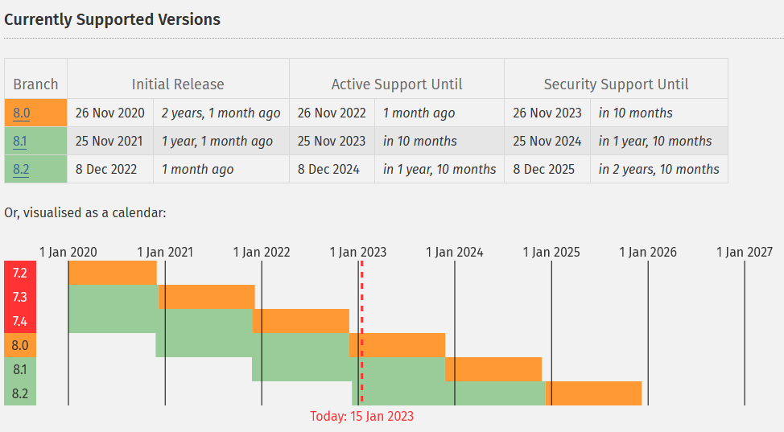

class: center, middle

### POO x Framework

# Langages de programmation

## Programmation orientée objet

---

class: middle

### Langages de programmation

# Table des matières

1. Présentation
2. Langages et paradigmes de programmation
   1. Histoire des langages de programmation
   2. Les paradigmes de programmation
3. Histoire de PHP
   1. Evolution de PHP
   2. Typage plus strict de PHP
   3. Comment PHP s'est construit
4. Utilisations courantes de PHP
   1. Développement web
   2. Comparaison avec d'autres langages
5. Outils et bibliothèques
   1. Bibliothèques et Frameworks
   2. PHP Standards Recommandations (PSR)
   3. Composer
6. Conclusion

---

class: center, middle

### Langages de programmation

# 1. Présentation

---

class: center, middle

### Langages de programmation

# 2. Langages et paradigmes de programmation

---

class: center, middle

### Langages de programmation

# 2. 1. Histoire des langages de programmation

---

class: middle

### Langages et paradigmes de programmation

# Les années 1950

- Les premiers langages de programmation (assembler, FORTRAN, etc.) ont été créés pour faciliter la programmation des ordinateurs de l'époque.
- Ces langages étaient généralement proches de la machine (bas niveau) et difficiles à comprendre pour les développeurs.

---

class: middle

### Histoire des langages de programmation

# Les années 1960

- LISP est apparu et est considéré comme le premier langage de programmation fonctionnel.

---

class: middle

### Histoire des langages de programmation

# Les années 1970

- SQL a été créé pour faciliter la gestion des bases de données relationnelles et est considéré comme un langage déclaratif.
- De nouveaux langages de programmation ont été créés pour répondre aux besoins des utilisateurs et des développeurs.
- Les langages tels que C, Pascal et Smalltalk ont introduit des concepts de programmation plus avancés tels que la programmation orientée objet, la gestion de la mémoire et la gestion des exceptions, rendant la programmation plus facile et plus sûre.

---

class: middle

### Histoire des langages de programmation

# Les années 1990

- Des langages orientés objet tels que Java, C++, Python et Ruby ont été créés pour faciliter la création de programmes modulaires et réutilisables.
- Ils ont également introduit des concepts tels que l'héritage, l'encapsulation et la polymorphisme.

---

class: center, middle

### Langages de programmation

# 2.2. Les paradigmes de programmation

Les paradigmes de programmation sont des façons de structurer, de concevoir et d'écrire des programmes informatiques. Ils sont utilisés pour décrire les différentes façons de résoudre les problèmes informatiques en utilisant des concepts de programmation spécifiques.

---

class: middle

### Les paradigmes de programmation

# Programmation procédurale

La programmation procédurale se concentre sur l'écriture de séquences d'instructions pour résoudre un problème. Elle est basée sur la division en fonctions et procédures indépendantes. Les langages procéduraux incluent C, FORTRAN et COBOL.

Exemple en C:

```c
int sum(int *list, int size) {
    int result = 0;
    for(int i = 0; i < size; i++) {
        result += list[i];
    }
    return result;
}
```

---

class: middle

### Les paradigmes de programmation

# Programmation orientée objet

La programmation orientée objet se concentre sur l'utilisation de classes et d'objets pour résoudre un problème. Elle met l'accent sur la définition des données et des opérations sur ces données. Les langages orientés objet incluent Java, C++, Python, Ruby, C# et PHP.

Exemple en Java:

```java
class List {
    private int[] data;
    public int sum() {
        int result = 0;
        for(int i = 0; i < data.length; i++) {
            result += data[i];
        }
        return result;
    }
}
```

---

class: middle

### Les paradigmes de programmation

# Programmation fonctionnelle

La programmation fonctionnelle se concentre sur l'utilisation de fonctions pour résoudre un problème. Elle met l'accent sur la manipulation de fonctions mathématiques pures, sans effet de bord, et sur la composition de fonctions. Les langages fonctionnels incluent Lisp, Haskell, Erlang, F# et Scala.

Exemple en Haskell:

```haskell
sum = foldl (+) 0
```

---

class: middle

### Les paradigmes de programmation

# Programmation déclarative

La programmation déclarative se concentre sur la déclaration des règles pour résoudre un problème plutôt que sur la définition d'un processus pour le résoudre. Elle met l'accent sur les données et les relations entre elles. Les langages déclaratifs incluent SQL et Prolog.

Exemple en SQL:

```sql
SELECT SUM(column) FROM table;
```

---

class: middle

### Les paradigmes de programmation

# Programmation logique

La programmation logique se concentre sur la définition de règles logiques pour résoudre un problème. Elle met l'accent sur la manipulation de données sous forme de propositions logiques. Les langages de programmation logique incluent Prolog et Mercury.

Par exemple, en utilisant le langage Prolog, nous pourrions écrire des règles qui décrivent la somme de tous les éléments d'une liste en utilisant la logique de déduction.

```prolog
sum(List, Sum) :- sum(List, 0, Sum).
sum([], Sum, Sum).
sum([Head|Tail], Acc, Sum) :- NewAcc is Acc + Head, sum(Tail, NewAcc, Sum).
```

---

class: middle

### Les paradigmes de programmation

# Combinaison des paradigmes

Il est important de noter que les différents paradigmes de programmation peuvent être utilisés ensemble pour créer des programmes plus facilement, certains langages comme Oz, Python, Racket, Scala, peuvent intégrer plusieurs paradigmes.

En utilisant le langage Oz, nous pourrions écrire une fonction qui prend en entrée une liste de nombres, et utilise la logique déclarative pour calculer la somme de tous les éléments de la liste.

```oz
fun {SumList L}
    case L of nil then 0 [] H|T then H+{SumList T} end
end
```

---

class: center, middle

### Langages de programmation

# 3. Histoire de PHP

---

class: center, middle

### Histoire de PHP

# 3.1. Évolution de PHP

---

class: middle

### Évolution de PHP

# Naissance

PHP (Personal Homepage Processor) a été créé en 1995 par Rasmus Lerdorf. Il a été initialement conçu pour générer des pages web dynamiques grâce à des scripts côté serveur. Au fil des ans, PHP a évolué et s'est enrichi de nouvelles fonctionnalités et améliorations.

---

class: middle

### Évolution de PHP

# Versions importantes

| Version                                   | Année de sortie | Nouvelles fonctionnalités                                                                             |
| ----------------------------------------- | --------------- | ----------------------------------------------------------------------------------------------------- |
| PHP Tools, FI, Construction Kit et PHP/FI | -               | Versions initiales de PHP                                                                             |
| PHP 3                                     | 1998            | Support des objets et des classes                                                                     |
| PHP 4                                     | 2000            | Support des références et des exceptions                                                              |
| PHP 5                                     | 2004            | Support des namespaces, des interfaces, des traits, des générateurs, des expressions régulières, etc. |

(Suite slide suivante)

---

class: middle

### Évolution de PHP

# Versions importantes (suite)

| Version        | Année de sortie | Nouvelles fonctionnalités                                                                                     |
| -------------- | --------------- | ------------------------------------------------------------------------------------------------------------- |
| PHP 5.3 et 5.4 | -               | Intégration de certaines fonctionnalités de PHP 6 qui n'a jamais été publié                                   |
| PHP 7          | 2015            | Gestion des erreurs, performances améliorées, support des types scalaires, type de retour des variables, etc. |
| PHP 8          | 2020            | Attributs, Expressions match, JIT, etc.                                                                       |

---

class: middle

### Évolution de PHP

# Exemple de code PHP/FI

```html
<!--include /text/header.html-->
<!--getenv HTTP_USER_AGENT-->
<!--ifsubstr $exec_result Mozilla-->
Hey, you are using Netscape!
<p>
  <!--endif-->
  <!--sql database select * from table where user='$username'-->
  <!--ifless $numentries 1-->
  Sorry, that record does not exist
</p>
<p>
  <!--endif exit-->
  Welcome
  <!--$user-->!
</p>
<p>
  You have
  <!--$index:0-->
  credits left in your account.
</p>
<p>
  <!--include /text/footer.html-->
</p>
```

---

class: middle

### Évolution de PHP

# Versions récentes

Depuis PHP 7.0, les versions sont publiées chaque année. Si une nouvelle version introduit des changements incompatibles avec les versions précédentes, elle est marquée comme une version majeure (par exemple, PHP 9.0). Sinon, elle est marquée comme une version mineure (par exemple, PHP 8.3).

Liens:

- [https://www.php.net/supported-versions.php](https://www.php.net/supported-versions.php)
- [https://www.php.net/releases/](https://www.php.net/releases/)

---

class: middle

### Évolution de PHP

# Versions récentes



---

class: center, middle

### Histoire de PHP

# 3.2. Typage plus strict de PHP

---

class: middle

### Typage plus strict de PHP

# À quoi sert le typage ?

- Améliorer la compréhension et lisibilité du code
- Augmenter la qualité du code
- Faciliter la maintenance et l'évolution
- Améliorer les performances
- Meilleure compatibilité avec les bibliothèques et frameworks

---

class: middle

### Typage plus strict de PHP

# Type Hints

PHP 5 a introduit les "type hints" pour les arguments de fonctions, ce qui permet de préciser le type de données attendu pour un argument donné.

```php
function maFonction(array $tableau) {
    // code
}
```

---

class: middle

### Typage plus strict de PHP

# Types de retour et types d'unions

PHP 7 a introduit les types de retour et d'unions, ainsi que le typage des propriétés des classes.

```php
function getFullName(string $firstName, string $lastName): string {
    return $firstName . ' ' . $lastName;
}

function getValue(int|float $value): int|float {
    return $value;
}

class User {
    public int $age;
}
```

---

class: center, middle

### Histoire de PHP

# 3.3. Comment PHP s'est construit

---

class: middle

### Comment PHP s'est construit

# Open Source

PHP est un projet open-source géré par la communauté. Il est développé par une équipe de développeurs bénévoles et soutenu par la Fondation PHP.

Lien:

- [https://github.com/php/php-src](https://github.com/php/php-src)

---

class: middle

### Comment PHP s'est construit

# RFC

Les modifications et les nouvelles fonctionnalités sont proposées sous forme de RFC (Requêtes pour Commentaires) et soumises à un vote de la communauté avant d'être intégrées à PHP.

Liens:

- [https://wiki.php.net/rfc](https://wiki.php.net/rfc)
- [https://php.watch/rfcs](https://php.watch/rfcs)

---

class: middle

### Comment PHP s'est construit

# Contribution

Les développeurs bénévoles sont encouragés à proposer des modifications et des nouvelles fonctionnalités, et leur contribution est très appréciée. Aujourd'hui, la moitier des contributeurs sont rémunérés par la Fondation PHP (créée fin 2021).

Lien:

- [https://opencollective.com/phpfoundation](https://opencollective.com/phpfoundation)

---

class: center, middle

### Langages de programmation

# 4. Utilisations courantes de PHP

---

class: middle

### Utilisations courantes de PHP

# 4. 1. Développement web

---

class: middle

### Utilisations courantes de PHP

# Développement web

PHP est un langage de programmation très populaire pour le développement web. Il est souvent utilisé pour créer des sites web dynamiques qui nécessitent une interaction avec une base de données. Il peut être combiné avec des technologies telles que HTML, CSS et JavaScript pour créer des sites web interactifs.

- Utilisé avec MySQL pour gérer les données des utilisateurs, les produits, les commandes, etc.
- Utilisé avec des frameworks tels que Laravel, Symfony, CodeIgniter, etc.
- Utilisé pour créer des systèmes de gestion de contenu (CMS) tels que WordPress, Drupal, Joomla, etc.

---

class: middle

### Développement web

# 4. 2. Comparaison avec d'autres langages

---

class: middle

### Utilisations courantes de PHP

# Comparaison avec d'autres langages

## Python

- Syntaxe plus simple et plus intuitive
- Moins populaire pour le développement web

## Ruby

- Utilisé pour le développement web avec Ruby on Rails
- Moins populaire pour le développement web

## Node.js

- Environnement d'exécution JavaScript côté serveur
- Permet de développer des applications web hautement concurrentes et performantes

## Java et C#

- Utilisés pour le développement d'applications web
- Plus souvent utilisés pour le développement d'applications d'entreprise

---

class: center, middle

### Langages de programmation

# 5. Outils et bibliothèques

---

class: center, middle

### Outils et bibliothèques

# 5. 1. Bibliothèques et Frameworks

---

class: middle

### Outils et bibliothèques

# Bibliothèques et Frameworks

- Frameworks: Laravel, Symfony, CodeIgniter et Zend
  - Routes, contrôleurs, modèles, vues, authentification et accès à la base de données
- CMS: WordPress, Drupal et Joomla
- Bibliothèques: PHPUnit, Guzzle, etc.

---

class: center, middle

### Outils et bibliothèques

# 5. 2. PHP Standards Recommandations (PSR)

---

class: center, middle

### Outils et bibliothèques

# PHP Standards Recommendations (PSR)

Les PHP Standards Recommendations (PSR) sont des lignes directrices pour l'écriture de code PHP qui visent à améliorer la qualité et la lisibilité du code.

---

class: middle

### Outils et bibliothèques

# PSR-1: Basic Coding Standard

- Définit les règles de base pour l'écriture de code PHP.

---

class: middle

### Outils et bibliothèques

# PSR-2: Coding Style Guide

- Définit les conventions de formatage de code pour PHP.

---

class: middle

### Outils et bibliothèques

# PSR-3: Logger Interface

- Définit une interface commune pour les systèmes de journalisation.

---

class: middle

### Outils et bibliothèques

# PSR-4: Autoloading Standard

- Définit les règles pour l'autoloading de classes en PHP.

---

class: middle

### Outils et bibliothèques

# PSR-6: Caching Interface

- Définit une interface commune pour les systèmes de cache.

---

class: middle

### Outils et bibliothèques

# PSR-7: HTTP Message Interface

- Définit une interface commune pour les objets de message HTTP.

---

class: middle

### Outils et bibliothèques

# PSR-11: Container Interface

- Définit une interface commune pour les conteneurs d'injection de dépendance.

Lien: [https://www.php-fig.org/psr/](https://www.php-fig.org/psr/)

---

class: center, middle

### Outils et bibliothèques

# 5. 3. Composer

---

class: middle

### Outils et bibliothèques

# Composer

Composer est un outil de gestion de dépendances pour PHP qui permet aux développeurs de gérer facilement les bibliothèques et les frameworks utilisés dans leur projet.

- Utilise un fichier de configuration `composer.json` pour décrire les dépendances
- Utilise un fichier `composer.lock` pour conserver l'état des dépendances
- Est devenu un outil standard pour la gestion de dépendances en PHP
- Permet aux développeurs d'installer et de mettre à jour facilement les dépendances

---

class: middle

### Outils et bibliothèques

# Gestionnaires de dépendances

| Langage | Gestionnaire de dépendances |
| ------- | --------------------------- |
| PHP     | Composer                    |
| Python  | pip                         |
| Ruby    | Gem                         |
| Node.js | npm                         |
| Java    | Maven, Gradle               |
| C#      | NuGet                       |

Lien: [https://getcomposer.org/](https://getcomposer.org/)

---

class: center, middle

### Langages de programmation

# 6. Conclusion
